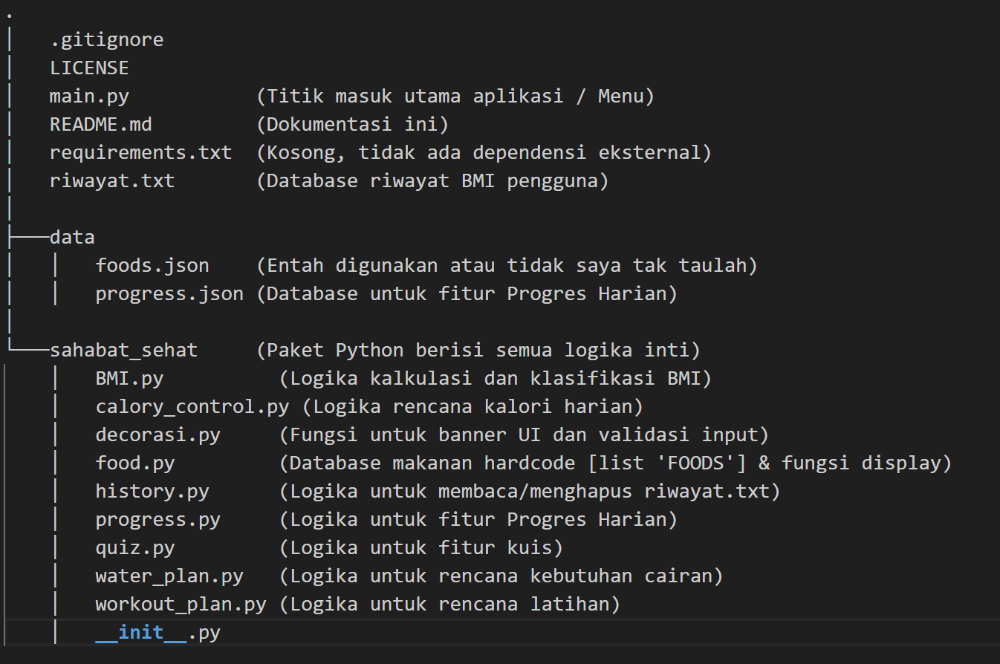

# Sahabat Sehat 🏋️‍♂️🍎💧

Sahabat Sehat adalah aplikasi kesehatan komprehensif berbasis terminal (CLI) yang dibangun menggunakan Python. Aplikasi ini dirancang untuk membantu pengguna memantau, mencatat, dan merencanakan berbagai aspek kesehatan harian mereka dalam satu antarmuka yang mudah digunakan.

## ✨ Fitur Utama

Aplikasi ini dibagi menjadi beberapa modul fungsional utama:

### 1. 📈 Pelacak Progres Harian
Modul inti untuk mencatat dan menganalisis aktivitas harian Anda.
* **Catat & Update Harian:** Tambah atau perbarui data harian (langkah, air, kalori, berat) untuk hari ini.
* **Manajemen Data:** Edit atau hapus data progres untuk tanggal tertentu jika terjadi kesalahan input.
* **Analisis Statistik:** Dapatkan ringkasan statistik (total perubahan berat badan, rata-rata harian, dan rekor tertinggi).
* **Visualisasi Data:**
    * **Grafik Mingguan:** Tampilkan grafik progres 7 hari terakhir *versus* target harian Anda.
    * **Lihat Riwayat:** Tampilkan semua riwayat progres dengan *pagination* (dijeda setiap 5 entri) agar mudah dibaca.

### 2. 💪 Kalkulator & Perencana
Alat untuk menghitung kebutuhan tubuh Anda dan merencanakan aktivitas.
* **Kalkulator BMI:** Menghitung Indeks Massa Tubuh (BMI), memberikan klasifikasi (Berat Badan Kurang, Normal, Obesitas), dan menyimpannya ke riwayat.
* **Perencana Latihan (Workout):** Memberikan rekomendasi rencana olahraga yang sangat detail berdasarkan **status BMI** dan **tujuan** (misal: menurunkan berat badan, menambah massa otot) serta frekuensi latihan yang Anda pilih per minggu.
* **Rencana Kalori Harian:** Menghasilkan rencana menu harian (dari database makanan) yang disesak acak untuk mendekati target kalori yang Anda tentukan.
* **Rencana Kebutuhan Air:** Menghitung kebutuhan cairan harian Anda (dalam liter dan gelas) berdasarkan berat badan dan memberikan rekomendasi jadwal minum.

### 3. 📚 Data & Utilitas
Fitur pendukung untuk mengelola data dan menguji pengetahuan Anda.
* **Database Makanan:** Melihat daftar makanan yang tersedia di database beserta detail kalori dan makronutrien (Protein, Karbohidrat, Lemak).
* **Riwayat BMI:** Melihat semua riwayat perhitungan BMI yang tersimpan atau menghapus data riwayat berdasarkan ID.
* **Kuis Nutrisi:** Kuis interaktif dengan tiga tingkat kesulitan (Easy, Normal, Hard) untuk menguji pengetahuan Anda tentang kalori makanan.

---

## 🚀 Cara Menjalankan

Aplikasi ini tidak memerlukan dependensi eksternal (tidak ada `requirements.txt`). Anda hanya perlu Python 3.x yang terinstal di sistem Anda.

1.  Buka terminal atau command prompt.
2.  Navigasi ke direktori utama proyek (folder `AP-9_Sahabat_Sehat`).
3.  Jalankan aplikasi dengan perintah:
    ```bash
    python main.py
    ```

---

## 📁 Struktur Proyek

Berikut adalah gambaran umum struktur file dan direktori dalam proyek ini.

## 📁 Struktur Proyek



---

## 🗃️ File Data

Aplikasi ini menyimpan data pengguna di dua file utama:

* **`riwayat.txt`**: File teks sederhana yang menyimpan *output* dari kalkulator BMI. Setiap baris berisi: `ID|Nilai BMI|Kategori|Kode Kategori`.
* **`data/progress.json`**: File JSON yang menyimpan data dari fitur "Progres Harian". Data disimpan dalam format kamus (dictionary) dengan *key* berupa tanggal (`YYYY-MM-DD`).

---

## 🧑‍💻 Tim Kolaborator (AP-9)

Proyek ini dibuat dan dikelola oleh:

* **Ahmad Panrita** - [naravan-dotcom](https://github.com/naravan-dotcom)
* **Muhammdad Syahdan** - [danmuh30-hub](https://github.com/danmuh30-hub)
* **Ilmi Ahamd Alfaridzi** - [AlfaFdz](https://github.com/AlfaFdz)
* **Moch. Putra Firmansyah Sultan** - [MochPutraFS](https://github.com/MochPutraFS)
* **Andi Muhammad Naufal Sulfahmi** - [naufalsulfahmi](https://github.com/naufalsulfahmi)
* **Erizq Affanditya Nursin** - [Erizq157](https://github.com/Erizq157)
* **Dzaky Dzulfikar Abidin** - [Dzakyabidin9706](https://github.com/Dzakyabidin9706)